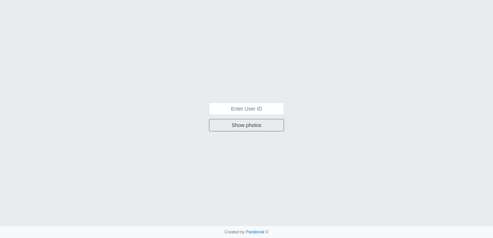
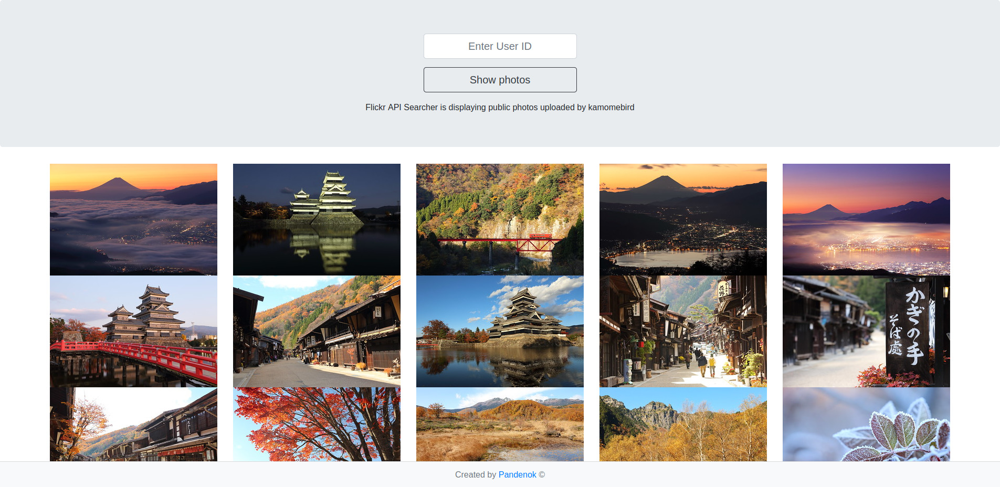

# Project: Flickr API

### What's this

A simple photo widget that allows to display photos from Flickr feed by the User ID.

### Functionality

This app fetches photos from Flickr by interacting with the Flickr API. Flickr API has a brilliant documentation and offers various methods to do a certain task. For the purporses of the assignment only few of them were used. For example, first, submitting your or someone else's ID in the form triggers `flickr.photos.search` method, and second, entering a blank ID will get you instead all recently pubslished public photos using `flickr.photos.getRecent` method. The app is very intuitive and informs the user about errors with appropriate flash messages (including Flickr API errors). Nevertheless, the styling was not requested, I built a minimalistic design using `bootstrap`, the most popular HTML, CSS, and JavaScript framework.

### Live Demo

You can view a demo [here](https://salty-cliffs-45843.herokuapp.com/)  
**HEADS UP**: Heroku server may need up to 30 sec to fire up a dyno. Be patient! :)

### Screenshots

<p float = 'left'>
    
    
</p>

### Built With

- Ruby on Rails - Web framework
- Figaro - Rails gem
- Flickr - Rails gem
- Bootstrap - HTML, CSS, and JavaScript framework
- Heroku - Cloud platform/server

### Getting started

To get started with the app, make sure you have Rails and Git installed on your machine  
Clone the repo to your local machine: 
```ruby
$ git clone https://github.com/Pandenok/flickr-api
```
Then, install the needed gems:
```ruby
$ bundle install
```
Follow the Getting Started [instructions](https://github.com/laserlemon/figaro) by `figaro` (you'll need your Flickr API key and Secret):
```ruby
$ bundle exec figaro install
```
Finally, on root path run a local server:
```ruby
$ rails server
```
Open browser to view application:
```ruby
localhost:3000
```

### Reflection

It is my first step into the world of external API's. It was a bit overwhelming in the beginning, because much of the material sort of assumes that you know what you’re doing, but once I made some trial and error calls and read documentation more carefully, it all made sense. I experimented with various methods and preferred to stick to the project criteria to dedicate some more time to the Bootstrap framework. After Bulma, using Bootstrap is more confusing at first, because IMHO the syntax is more complex and it's not so intuitive. In any case, considering how long it has been around and its large community, it's very easy to find answers, snippets, examples and tutorials for any question on the web. As far as for the majority of the toy projects I made so far, JavaScript elements were not required, for CSS part my personal preferences go to Bulma.